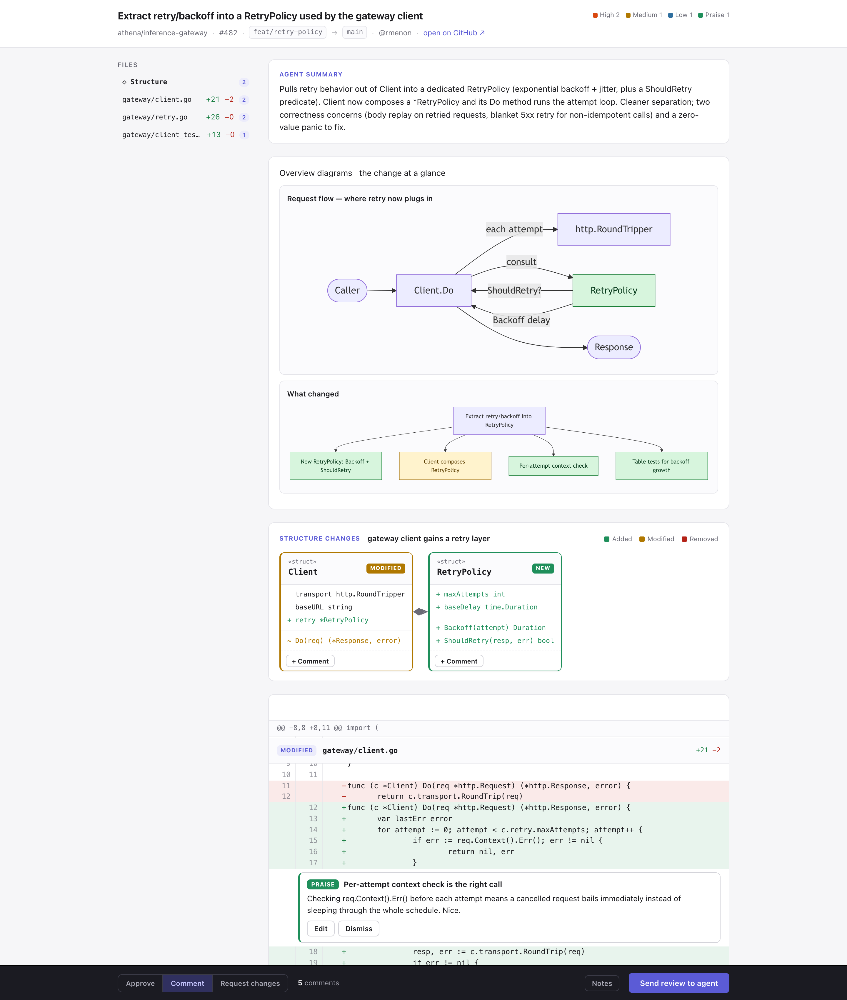

# loupe — interactive PR review for Claude Code

> The agent finds the issues. **You** curate them in a browser. The curated review comes back as JSON to post.

loupe turns a one-way "here are my review comments" dump into a feedback loop. Claude reads the
diff and writes anchored, severity-tagged **findings**; loupe serves a local web UI where you
**accept / edit / dismiss** each one, add your own line comments, eyeball **overview diagrams**
and a **UML structure map**, pick a verdict, and send the curated review back — ready to post as a
GitHub review.



**▶ [Watch the 60-second demo](https://ashish-work.github.io/loupe/#demo)** — the real UI in action (also on the [v1.0.0 release](https://github.com/ashish-work/loupe/releases/tag/v1.0.0)).

> Reviewing a real PR: the agent summary, three **overview diagrams** (architecture overlay,
> capability map, user journey), and the **UML structure** map sit above the diff; you accept /
> edit / dismiss findings and send the curated review back. A standalone demo also ships at
> [`examples/demo.html`](plugins/loupe/skills/loupe/examples/demo.html) — open it in a browser.

## What you get

- **Curated findings** — Claude proposes; you keep what's right. A few strong findings beat a wall of nitpicks.
- **Overview diagrams** (Mermaid) — architecture overlay, capability map, or user-journey flow, rendered above the diff so you grasp the *idea* of the change before the line diff. Claude asks which to include.
- **UML structure map** — for type-shape changes (added/modified/removed classes, interfaces, relationships), color-coded and clickable into the diff.
- **One-round loop** — submit and the curated JSON (kept comments + your own + verdict) returns to the agent, which posts a GitHub review or summarizes.

## Requirements

- **Python 3.8+** (standard library only — nothing to `pip install`).
- **`gh` CLI** (optional) — for fetching/posting GitHub PRs. Not required: loupe accepts any unified diff, so a local `git diff` works for pre-PR review.
- Mermaid diagrams render from a CDN; offline, loupe falls back to showing the diagram source.

## Install (Claude Code plugin)

```bash
# in Claude Code
/plugin marketplace add ashish-work/loupe
/plugin install loupe@loupe
```

Then just ask Claude to review a PR (or run `/loupe`). Claude assembles the review and opens the UI in your browser.

### Alternative: install as a plain skill

```bash
git clone https://github.com/ashish-work/loupe ~/tmp/loupe \
  && cp -R ~/tmp/loupe/plugins/loupe/skills/loupe ~/.claude/skills/loupe
```

## Usage

Ask Claude: *"review PR #42"* / *"review this branch before I merge"* / *"/loupe"*. Claude:
1. Fetches the PR metadata + diff (or builds it from `git diff base...HEAD`).
2. Writes findings, optionally a UML `structure` and Mermaid `diagrams`.
3. Opens the loupe UI (it blocks until you submit).
4. Reads your curated review and posts it to GitHub (or summarizes).

To see the UI with no PR:

```bash
python3 plugins/loupe/skills/loupe/scripts/loupe.py \
  plugins/loupe/skills/loupe/examples/example-review.json
```

## How it works

`scripts/loupe.py` is a zero-dependency Python HTTP server. The agent passes it a `review.json`
(diff + findings + optional `structure`/`diagrams`); it renders a self-contained UI, opens the
browser, **blocks** until you hit *Send review to agent*, then prints the curated review as JSON to
stdout. See [`SKILL.md`](plugins/loupe/skills/loupe/SKILL.md) for the full agent contract.

## License

[Apache-2.0](LICENSE) © Ashish Gupta.
